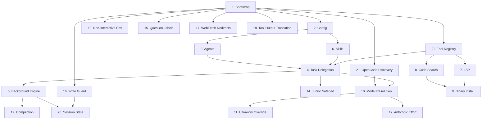

# oh-my-opencode — Features

A high-level grouping of every capability in this repo. "Feature" here means a user-visible behavior or runtime mechanism, regardless of which folder its code lives in.

**Generated:** 2026-04-26 — 22 features.

## Dependency overview

## Features

| # | Name | Location | Usage |
|---|------|----------|-------|
| 1 | Plugin Bootstrap & Lifecycle | `src/index.ts` + `src/create-*.ts` + `src/plugin-{interface,dispose,state}.ts` | Boots the plugin once on load, wires every other feature together, cleans up on reload. |
| 2 | Runtime Config System | `src/plugin-config.ts` + `src/config/` | One TypeScript constant controls every knob in the plugin. Edit, restart, done. |
| 3 | Agent Identity & Prompt Assembly | `src/agents/` | Defines who Sisyphus, Oracle, Librarian, Explore, Metis & Momus are — their prompts, models, and what they're allowed to do. |
| 4 | Task Delegation Tool (`task`) | `src/tools/delegate-task/` | The `task()` tool agents call to hand off work to a subagent — sync or async. |
| 5 | Background Task Engine | `src/features/background-agent/` + `src/create-managers.ts` | Runs delegated subagents in parallel, polls them, kills runaways, and notifies the parent when done. |
| 6 | Builtin Skills System | `src/features/builtin-skills/` | Reusable expertise packs (`git-master`, `agent-browser`, `frontend-ui-ux`, `review-work`) injected into a subagent's prompt via `load_skills`. |
| 7 | LSP Tooling | `src/tools/lsp/` | Real-language-server-backed `lsp_*` tools for diagnostics, go-to-def, references, symbols, rename. |
| 8 | Code-Search Tools | `src/tools/{ast-grep,grep,glob}/` | Three search tools — AST-aware (`sg`), text (`rg`), filename (`glob`) — for agents to read the codebase. |
| 9 | Binary Install Pipeline | `src/shared/{binary-downloader,zip-*,archive-entry-validator}.ts` + per-tool `downloader.ts` | Auto-downloads & extracts CLI binaries (ripgrep, ast-grep) on first use, host-aware and validated. |
| 10 | Model Resolution & Variants Pipeline | `src/shared/model-*.ts` + `src/generated/model-capabilities.generated.json` | Turns `"openai/gpt-5.4"` / category names / variants into a real, available model with sensible fallbacks. |
| 11 | Ultrawork Model Override | `src/plugin/ultrawork-*.ts` | Type "ultrawork" in a message → that turn (and the agent's next turns) get bumped to a stronger model. SQLite-backed. |
| 12 | Anthropic Effort Hook | `src/hooks/anthropic-effort/` + `src/plugin/hooks/create-session-hooks.ts` | On Claude-family `chat.params`, injects / clamps reasoning effort so `max` only reaches models that actually support it. |
| 13 | Non-Interactive Env Hook | `src/hooks/non-interactive-env/` + `src/plugin/hooks/create-session-hooks.ts` | Before `bash`, auto-prepends non-interactive env vars to git commands and warns on obviously interactive commands that would hang. |
| 14 | Sisyphus Junior Notepad Hook | `src/hooks/sisyphus-junior-notepad/` + `src/plugin/hooks/create-session-hooks.ts` | Before orchestrator-spawned `task()` calls, injects the Junior notepad directive so subagents keep the expected scratchpad behavior. |
| 15 | Question Label Truncator Hook | `src/hooks/question-label-truncator/` + `src/plugin/hooks/create-session-hooks.ts` | Before question tools run, trims long option labels down to compact UI-safe lengths. |
| 16 | Write-Existing-File Guard Hook | `src/hooks/write-existing-file-guard/` + `src/plugin/hooks/create-tool-guard-hooks.ts` | Tracks per-session read permissions and blocks `write` from overwriting existing files unless that session just read them (or explicitly bypasses). |
| 17 | WebFetch Redirect Guard Hook | `src/hooks/webfetch-redirect-guard/` + `src/plugin/hooks/create-tool-guard-hooks.ts` | Pre-resolves redirects for `webfetch` and rewrites redirect-loop failures into a stable max-redirect error. |
| 18 | Tool Output Truncator Hook | `src/hooks/tool-output-truncator.ts` + `src/plugin/hooks/create-tool-guard-hooks.ts` | After noisy tools run, dynamically truncates oversized output so search / LSP / webfetch results stay within model context budgets. |
| 19 | Compaction Awareness | `src/shared/compaction-marker.ts` + `src/features/background-agent/compaction-aware-message-resolver.ts` | Keeps background agents stable when OpenCode compacts session history under their feet. |
| 20 | Session State & Cursors | `src/shared/session-*.ts` + `src/shared/{subagent-session-registry,main-session-id,internal-initiator-marker}.ts` | Per-session memory — which model, which tools, which sub-sessions, which messages were OMO-internal. |
| 21 | OpenCode Runtime Discovery | `src/shared/opencode-*.ts` + `src/shared/data-path.ts` | Finds OpenCode's install on this machine — config dir, message dir, version, server auth. |
| 22 | Tool Registry & Schema Plumbing | `src/plugin/{tool-registry,normalize-tool-arg-schemas}.ts` + `src/create-tools.ts` | Registers every custom tool with OpenCode, normalizes schemas, respects `disabled_tools` and the OpenAI 128-tool cap. |

## Declared but not implemented

Surfaces and config fields that exist as contracts but currently have no behavior:

| Item | Status |
|------|--------|
| `experimental.chat.messages.transform` | no-op stub |
| `experimental.chat.system.transform` | no-op stub |
| `experimental.session.compacting` | no-op stub |
| `interactive-bash-session` hook name | declared in `HookName`, no handler |
| `dynamic_context_pruning` config | declared in types, not wired |
